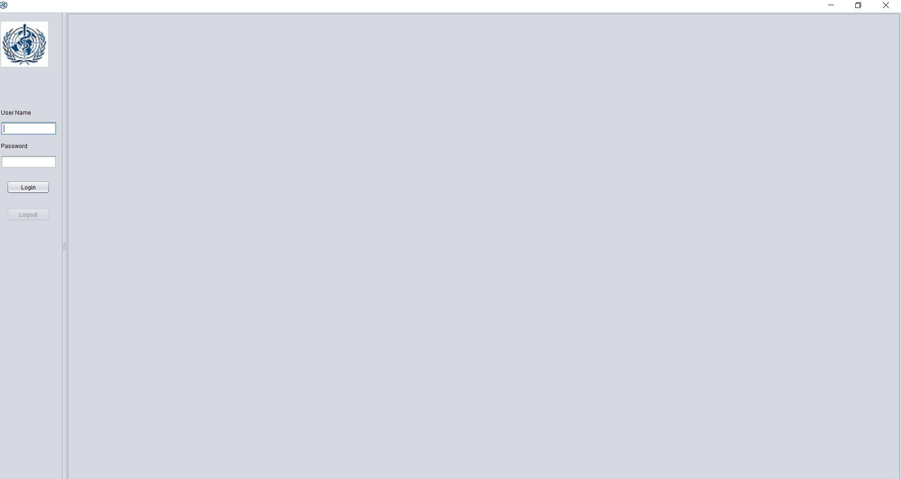

# Application Engineering and Development in Java - Ecosystem Model
```
                Analysis of Efficacy of Drugs that treat Hypothyroidism
```

 [Link to the project](https://github.com/chandrikabolla/aed_project) In case if you missed the direct link to my project on github
 * README files are included in each directory of this project to understand the structure and components of this project
## Getting Started
 [Link to src](https://github.com/chandrikabolla/aed_project/tree/master/FinalProject%20Sat/FinalProject/src)- click on this link for direct access to src folder 
Otherwise, you can go through FinalProject Sat/FinalProject/src
The jar files that are needed to run this project are provided in the  [FinalProject Sat/Chart Libraries folder](https://github.com/chandrikabolla/aed_project/tree/master/FinalProject%20Sat/Chart%20Libraries) 
You may need to download or add the plugin for jCalendars to your IDE 
* You can directly download and clone this project, and run it on your local machine on your IDE or using cmd
### Prerequisites
You may need to have your Java Development Environment setup already.
This project is built in Netbeans IDE, so it has the project structure of Netbeans. It's easy to find, open, run this project on Netbeans IDE if you have it already.
You can download latest version of this IDE from this [link](https://netbeans.org/downloads/) suitable for your local machine.
 Here is how to run this project on your machine using cmd
* Go to the directory where you downloaded the project file and extracted it.
 For example: `cd  C:/users/chand/FinalProject Sat/FinalProject/src/userinterface `
* And compile the java file using the command `javac MainJFrame.java` 
* And then run it using `java MainJFrame` , and there you get this big screen like below


 
### Installing
You can build an executable jar file for quick run of this project on Netbeans and also other IDEs and cmd
`` In Netbeans ``
1. Right-click on the Project name
2. Select Properties
3. Click Packaging
4. Check Build JAR after Compiling
5. Check Compress JAR File
6. Click OK to accept changes
7. Right-click on a Project name
8. Select Build or Clean and Build
* Your executable jar file can be seen in your projectname/dist/ folder

### Built With
* Swing - Java Framework
* Netbeans IDE - Development IDE/Environment

---

### Authors
* [Chandrika Bolla](https://github.com/chandrikabolla) 
### Contributors
* [Chandrika Bolla](https://github.com/chandrikabolla)
### License
MIT
### Acknowledgements
* Thanks to the Teaching Assistants and Professor Bugrara for the rigorous assignments in Java and Object Oriented Concepts
* Inspiration from WHO - the only organization committed and dedicated to healthcare services for its 195 state members
